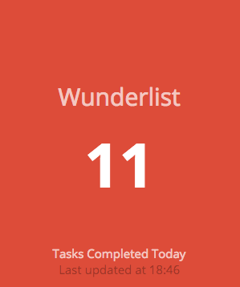

# dashing-wunderlist-stats
>:ballot_box_with_check: Wunderlist Stats in your Dashing Dashboard

A [Dashing](https://github.com/Shopify/dashing) widget to view your Wunderlist task completion statistics.

## Dependencies

The Wunderlist Stats widget uses the `wunderlist-api` gem, so add that to your project's `Gemfile`.

```ruby
gem 'wunderlist-api'
```

Now run `bundle install` to download the gem.

## Authorization

To get stats from Wunderlist, you have to create an app on the Wunderlist [Developer Website](https://developer.wunderlist.com/apps). 

1. [Create](https://developer.wunderlist.com/apps/new) a new Wunderlist app and generate an access token. The App URL and Auth Callback URL are unimportant.
* Take note of your `client_id` and `access_token`. Enter these two keys into `wunderlist_stats.rb` or, preferably, create a `conf/` directory in your main dashboard project, and create a file called `wunderlist_stats.yaml` formatted in the following manner:
    
    ```yaml
    :access_token: xxx
    :client_id: xxx
    ```
* Add widgets to your dashboard using the instructions below.

## Usage

**For all widgets:** Copy `wunderlist_stats.rb` into your `jobs/` folder.

### *Tasks Completed Today* Widget
Add this widget to one of your dashboards `.erb` files.
```erb
<li data-row="1" data-col="1" data-sizex="1" data-sizey="1">
  <div data-id="wunderlist_completed_today" data-view="Number" data-title="Wunderlist" data-moreinfo="Tasks Completed Today" style="background-color:#dd4c39"></div>
</li>
```



**~More to come~**
<!-- ### *Tasks Completed This Week* Widget
1. Install jorgemorgado's [dashing-barchart](https://github.com/jorgemorgado/dashing-barchart)
2. Add this widget to one of your dashboards. -->